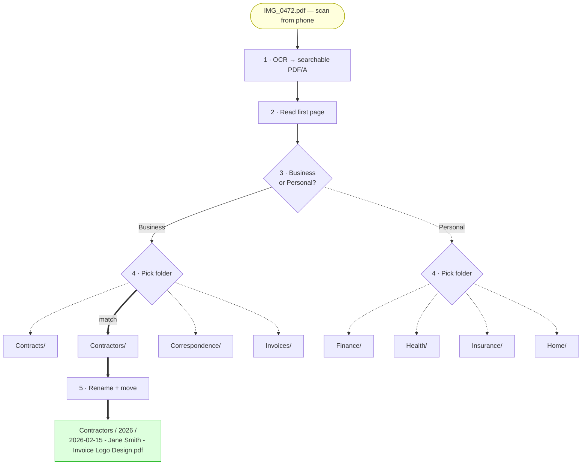

# docfiler

Drop documents into a folder. AI reads them, names them, and files them.

## Install

```bash
brew install ocrmypdf tesseract tesseract-lang
git clone https://github.com/mortenjust/docfiler.git
cd docfiler
pip3 install .
```

Requires [Claude Code](https://claude.ai/claude-code) for classification (`claude` must be in your PATH).

## How it works



> A badly named phone scan gets OCR'd, classified as a business document,
> matched to the Contractors folder, renamed, and filed — in two `docfiler process` runs.
> The first run (triage) routes it to the right inbox. The second run (file) puts it in the right folder.

## Setup

Put a `docfiler.yaml` in any folder you want to use as an inbox. There are two modes:

### File mode

Reads the folder tree above the inbox and files documents into the right subfolder.

```yaml
# ~/Documents/Inbox/docfiler.yaml
mode: file
tree_root: ..
context: "family household"
```

Drop a PDF in `~/Documents/Inbox/`, run `docfiler process`, and it gets moved to something like `~/Documents/Insurance/2026/2026-01-15 - Allianz - Policy Renewal.pdf`.

### Triage mode

Classifies documents and routes them to different inboxes.

```yaml
# ~/Scans/docfiler.yaml
mode: triage
context: "freelancer who also has personal documents"
routes:
  Business: ~/Documents/Work/Inbox
  Personal: ~/Documents/Personal/Inbox
processed: Processed
```

Drop a scan in `~/Scans/`, run `docfiler process`, and it gets copied to the right inbox and archived to `~/Scans/Processed/`.

## Usage

```bash
cd ~/Documents/Inbox

docfiler process              # process all files in this inbox
docfiler process invoice.pdf  # process one specific file
docfiler status               # show config and how many files are waiting
```

## What it does

For each file:

1. **OCR** — converts PDFs to searchable PDF/A. Images get OCR'd with tesseract.
2. **Read** — extracts text from the first page (no AI needed, instant).
3. **Classify** — sends the text to Claude, which picks the destination folder and a filename.
4. **Move** — moves (or copies + archives in triage mode) the file to its destination.
5. **Log** — appends a row to `filing-history.csv` in the inbox folder.

## Naming convention

Files are renamed to:

```
YYYY-MM-DD - Sender - Topic in English.pdf
```

The date is the document's own date, not today. Topics are always in English (translated if needed).

## Supported file types

PDF, JPG, PNG, GIF, WebP, HEIC, TXT, HTML, CSV

## Filing history

Every processed file is logged to `filing-history.csv` in the inbox folder:

```csv
"original_filename","new_filename","destination","filed_at"
"scan001.pdf","2026-01-15 - Allianz - Policy Renewal.pdf","Insurance/2026","2026-01-15T10:30:00"
```
